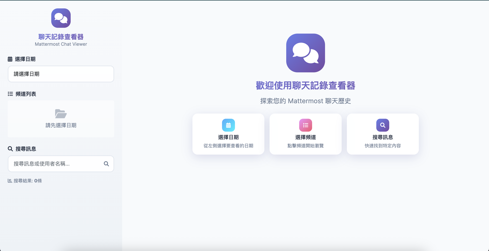

# Mattermost 聊天記錄查看器 (EasyViewer)

這是一個簡易的 Web 介面，用於查看使用 MattermostDll 下載的聊天記錄。


## 功能特色

- 📅 **日期選擇**: 選擇不同日期的下載記錄
- 💬 **頻道瀏覽**: 瀏覽所有可用的頻道
- 🔍 **訊息搜尋**: 根據內容或使用者名稱搜尋訊息
- 📎 **附件下載**: 直接下載聊天中的附件檔案
- 🕒 **時間排序**: 按時間順序顯示聊天記錄
- 💬 **回覆顯示**: 清楚標示回覆訊息
- 🎨 **現代化介面**: 採用漸層設計和玻璃擬態效果
- ✨ **動畫效果**: 流暢的載入動畫和訊息淡入效果
- 🌈 **視覺優化**: 圓角設計、陰影效果和現代色彩搭配
- 📱 **響應式設計**: 完美適配各種螢幕尺寸

## 安裝與使用

### 1. 安裝依賴套件

```bash
cd EasyViewer
pip install -r requirements.txt
```

### 2. 啟動應用程式

```bash
python app.py
```

### 3. 開啟瀏覽器

在瀏覽器中開啟 `http://localhost:5003`

## 使用說明

### 基本操作

1. **選擇日期**: 在左側邊欄選擇要查看的下載日期
2. **選擇頻道**: 點擊頻道名稱來載入聊天記錄
3. **瀏覽訊息**: 在右側主要區域查看聊天記錄
4. **搜尋訊息**: 使用搜尋框來尋找特定訊息或使用者
5. **下載附件**: 點擊附件連結來下載檔案

### 介面說明

#### 左側邊欄
- **現代化標題**: 採用漸層背景和圓角設計的應用程式標題
- **日期選擇器**: 具有現代化樣式的下拉選單選擇日期
- **頻道列表**: 採用卡片式設計，具有懸停效果的頻道清單
- **搜尋框**: 具有圖示和現代化樣式的搜尋輸入框

#### 主要區域
- **歡迎頁面**: 具有漸層背景和使用說明的歡迎介面
- **頻道資訊**: 採用卡片式設計顯示頻道名稱、匯出時間和總訊息數
- **聊天記錄**: 具有淡入動畫效果的訊息顯示
- **訊息卡片**: 採用圓角設計和陰影效果的訊息容器
- **載入動畫**: 流暢的載入指示器和動畫效果
- **附件顯示**: 現代化的附件卡片設計，支援圖片預覽

### 訊息類型

- **一般訊息**: 白色背景的標準訊息
- **回覆訊息**: 左側有黃色邊框的回覆訊息
- **附件訊息**: 包含可下載檔案的訊息
- **程式碼區塊**: 以等寬字體顯示的程式碼

### 附件處理

- ✅ **存在的附件**: 顯示為藍色可點擊連結
- ❌ **遺失的附件**: 顯示為紅色警告標籤
- 📁 **自動重命名**: 系統會自動處理重複檔名的附件

## 技術規格

### 後端技術
- **Flask**: Python Web 框架
- **JSON**: 資料格式處理
- **Path**: 檔案路徑管理

### 前端技術
- **Bootstrap 5**: UI 框架
- **Font Awesome**: 圖示庫
- **jQuery**: JavaScript 函式庫
- **CSS3**: 現代化樣式設計
  - CSS 變數系統
  - 漸層背景效果
  - 玻璃擬態 (Glassmorphism) 設計
  - CSS 動畫和過渡效果
  - 自定義滾動條樣式
- **響應式設計**: 支援各種螢幕尺寸
- **現代化 UI**: 圓角設計、陰影效果、懸停動畫

### 資料結構

應用程式預期的資料夾結構：
```
results/
└── YYYYMMDD/          # 日期資料夾
    └── 頻道名稱/
        ├── 頻道名稱.json   # 聊天記錄
        ├── 001_檔案.pdf    # 附件檔案
        └── 002_code.txt    # 程式碼檔案
```

## 故障排除

### 常見問題

1. **找不到聊天記錄**
   - 確認 `results` 資料夾位於 `EasyViewer` 的上一層目錄
   - 檢查日期資料夾格式是否為 8 位數字 (YYYYMMDD)

2. **附件無法下載**
   - 確認附件檔案確實存在於頻道資料夾中
   - 檢查檔案權限是否正確

3. **頁面載入緩慢**
   - 大型聊天記錄可能需要較長載入時間
   - 考慮使用搜尋功能來縮小範圍

4. **搜尋無結果**
   - 搜尋功能區分大小寫
   - 確認關鍵字拼寫正確

### 效能優化

- 應用程式會自動處理大型 JSON 檔案
- 搜尋功能在前端執行，響應速度快
- 附件採用串流下載，節省記憶體

## 開發資訊

- **版本**: 2.0.0 (現代化設計版本)
- **相容性**: Python 3.7+
- **設計特色**: 現代化 UI/UX 設計
- **更新內容**:
  - 全新的視覺設計語言
  - 漸層和玻璃擬態效果
  - 流暢的動畫和過渡效果
  - 改進的使用者體驗
- **授權**: 與主專案相同
- **維護**: 與 MattermostDl 專案一同維護